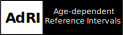
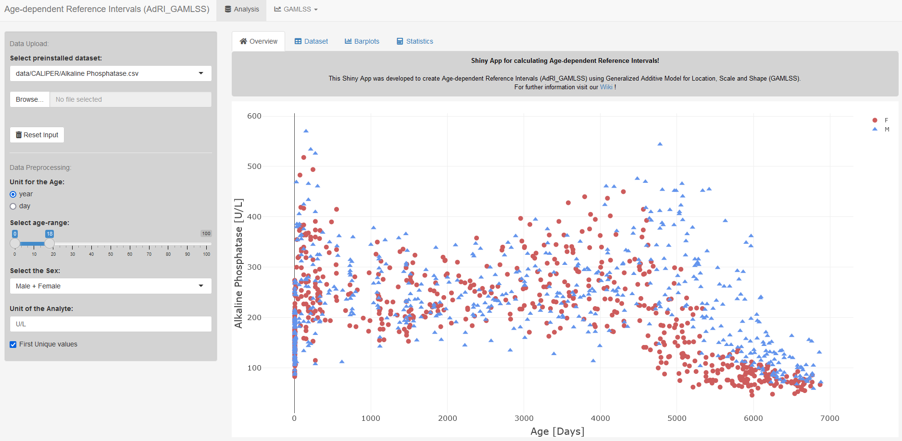

# Shiny App: AdRI_GAMLSS




**Shiny App for calculating Age-dependent Reference Intervals!**

This Shiny App was developed to create **A**ge-**d**ependent **R**eference **I**ntervals (**AdRI**) using [Generalized Additive Models for Location, Scale and Shape (GAMLSS)](https://github.com/SandraKla/AdRI_GAMLSS/wiki).



## Installation 

**Method 1:**
Use the function ```runGitHub()``` from the package [shiny](https://cran.r-project.org/web/packages/shiny/index.html):

```bash
if("shiny" %in% rownames(installed.packages())){
  library(shiny)} else{
  install.packages("shiny")
  library(shiny)}
runGitHub("AdRI_GAMLSS", "SandraKla")
```

**Method 2:**
Download the Zip-File from this Shiny App. Unzip the file and set your working direction to the path of the folder. 
The package [shiny](https://cran.r-project.org/web/packages/shiny/index.html) and [shinydashboard](https://cran.r-project.org/web/packages/shinydashboard/index.html) must be installed before using the Shiny App:

```bash
# Test if shiny is installed:
if("shiny" %in% rownames(installed.packages())){
  library(shiny)} else{
  install.packages("shiny")
  library(shiny)}
```
And then start the app with the following code:
```bash
runApp("app.R")
```

All required packages are downloaded when starting this app or imported if they already exist. For more information about the required packages use the [Wiki](https://github.com/SandraKla/AdRI_GAMLSS/wiki).

## Contact

You are welcome to:
- Submit suggestions and Bugs at: https://github.com/SandraKla/AdRI_GAMLSS/issues
- Make a pull request on: https://github.com/SandraKla/AdRI_GAMLSS/pulls
- Write an Email with any questions and problems to: s.klawitter@ostfalia.de

Link to the publication: [A visualization tool for continuous reference intervals based on GAMLSS](https://www.degruyter.com/document/doi/10.1515/labmed-2023-0033/html)

## Disclaimer:

Only anonymized data may be uploaded to this application.
This application is provided “as is” and “as available”, without any warranties of any kind, express or implied.
The results are provided for informational and research purposes only and must not be used for diagnosis, treatment, prevention, or clinical decision-making.
No warranty is given regarding the accuracy, completeness, reliability, or timeliness of the results.
This application is not a medical device or medical product and does not replace professional medical advice.
To the fullest extent permitted by law, the author disclaim all liability for any direct, indirect, incidental, consequential, or special damages arising from the use of this application or its results.
Use of this application is entirely at your own risk.